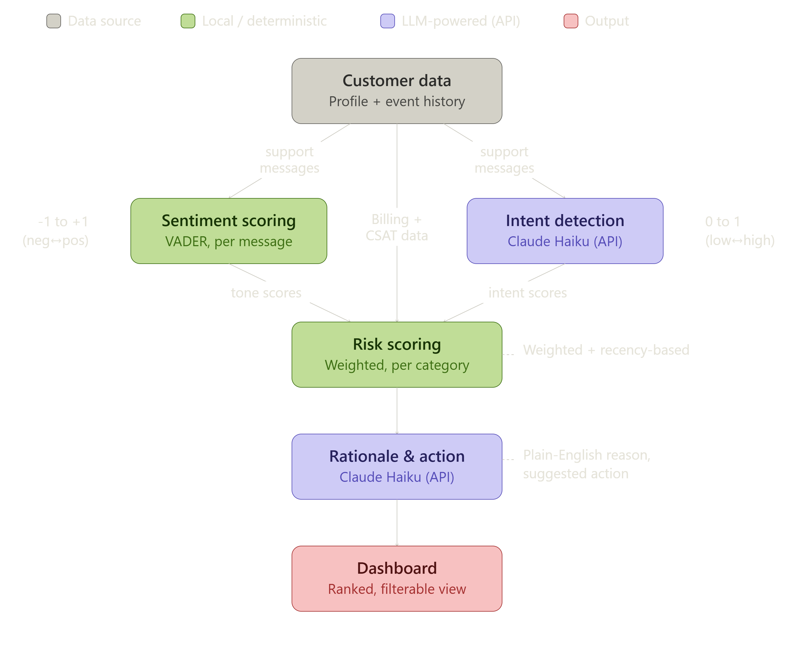
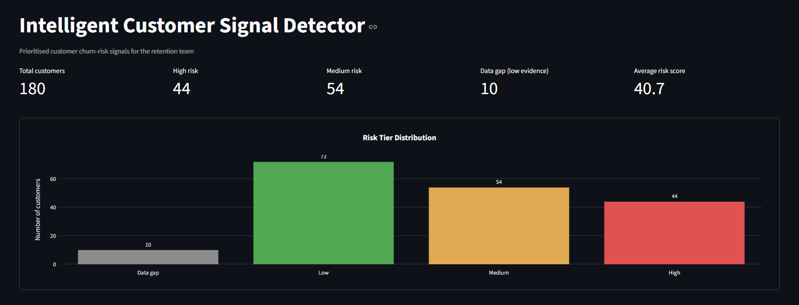
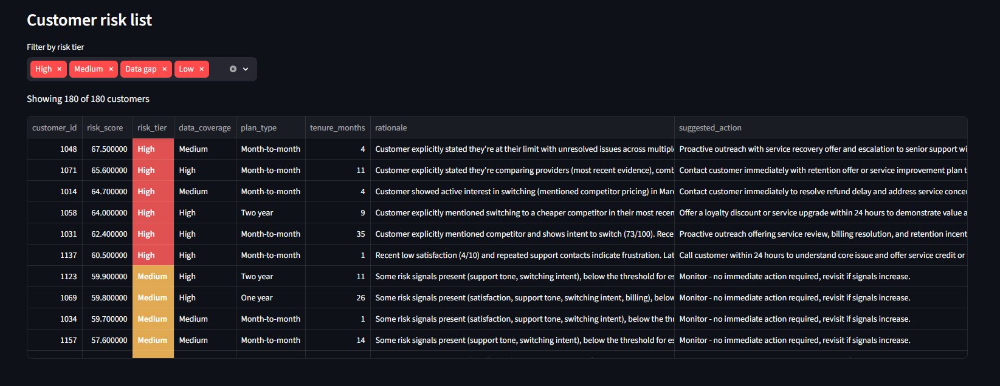
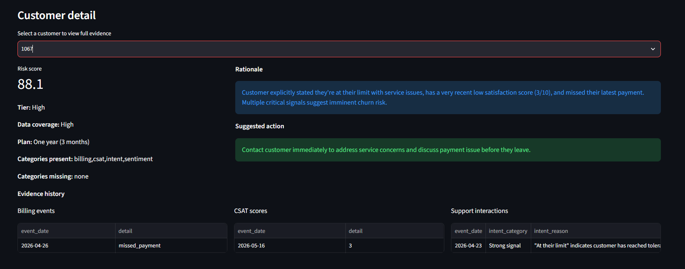

# 🔍 Intelligent Customer Signal Detector

An AI-powered prototype that reads customer support interactions, satisfaction scores, and billing history, and produces a risk score, a plain-English explanation, and a recommended retention action for every customer.

---

## 📋 What This Solves

Customer warning signs are usually scattered across different systems: support tickets in one place, billing records in another, satisfaction surveys somewhere else. Nobody's looking at all three together for the same customer, so patterns get missed until a customer has already decided to leave.

This tool pulls those signals together for every customer and produces a **risk score out of 100**, a **plain-English explanation** of why an at-risk customer is in that situation, and a **recommended action** — tailored to that customer's specific evidence — for the retention team to increase their engagement and reduce the chance of losing them.

---

## 🗂️ The Data

Each customer has two kinds of information:

**1. A profile** — how long they've been a customer, their plan type, monthly charge, payment method.

**2. A history of events** over time, of three kinds:

| Event type | What it is | Example |
|---|---|---|
| **Support interaction** | A note from a customer support conversation | *"Customer called about a billing error, unresolved after two attempts"* |
| **Billing event** | A record from the billing system | `missed_payment`, `late_payment`, `on_time_payment` |
| **CSAT survey** | A customer satisfaction score they gave, out of 10 | `4/10` |

This project uses a realistically-structured **synthetic dataset** (180 customers, ~900 events) rather than a real one. Publicly available datasets in this domain typically have limitations that prevented a clean fit for this brief — most either lack genuine per-customer history over time, lack multiple signal types (billing, satisfaction, and support text together), or lack a real customer identifier linking events across sources (often for privacy reasons). The synthetic data was built to mirror realistic telecom customer patterns, with some customers deliberately "planted" as likely to churn and others as likely to stay — which becomes useful later, for checking the system actually works (see **Validation** below).

---

## ⚙️ How It Works



**Step 1 — Sentiment scoring.** Every support message is scored for emotional tone (positive, negative, neutral) using **VADER**, a lightweight, free sentiment-analysis tool well-suited to short text.

**Step 2 — Intent detection.** Tone alone isn't enough — a customer can calmly mention *"I've been comparing other providers"* without sounding angry at all, and a pure tone-based tool can miss that entirely (this was tested and confirmed during development). So a language model — **Claude Haiku**, via Anthropic's API — reads each message specifically for *content*, judging whether it suggests the customer is considering leaving, independent of how it's phrased.

**Step 3 — Risk scoring.** Now that each customer's satisfaction scores, message tone, switching-intent signals, and billing history are all captured as numbers, they're combined into one overall **risk score (0–100)**. A few deliberate design choices here:
- **Recent evidence counts more than old evidence** — a customer who had one bad interaction a while ago but has been fine since is treated as lower risk than a customer showing the same problem in their most recent interaction.
- **Some signal types are trusted more than others.** Priority order: **CSAT > Intent ≈ Billing > Sentiment (tone)**. A customer's own satisfaction rating (CSAT) is weighted highest, since it's a direct statement from the customer, not something inferred. Message tone is weighted lowest, since it was directly observed to be the least reliable signal on its own.
- **The scoring is fully transparent, deterministic maths** — no black-box model. Every score can be traced back to exactly which pieces of evidence produced it.

**Step 4 — Explanation.** For customers flagged as genuinely high-risk (and with enough supporting evidence to trust the score), Claude Haiku is used again — this time to turn their specific evidence into a short, human-readable explanation and a concrete suggested action. For customers who are clearly low-risk or moderate, this is generated automatically without an AI call, since there's no real ambiguity to reason about — keeping the system fast and inexpensive.

**Step 5 — Dashboard.** All of the above is displayed in an interactive Streamlit dashboard: a summary panel, a colour-coded, sortable risk list, a distribution chart, and a detail view per customer showing their full evidence trail.

---

## 📸 Dashboard

**Summary panel and risk tier distribution:**


**Risk-ranked customer list:**


**Individual customer detail view (Customer 1067, the example used below):**


---

## ✅ Validation

Risk scores were checked against each customer's hidden "planted" outcome (never shown to the scoring system) using **AUC-ROC**, a standard measure of how well a score ranks two groups apart (0.5 = random guessing, 1.0 = perfect separation).

**Result: AUC = 0.884.** In plain terms, given one random customer planted to churn and one planted to stay, the system correctly scores the churning customer higher 88% of the time.

The current cutoff for flagging a customer as high-risk (score ≥ 60) achieves 84% accuracy, 70% precision, and 68% recall. This cutoff isn't fixed — a lower threshold catches more at-risk customers at the cost of more false alarms, and vice versa. A 60-point cutoff was chosen as a reasonable middle ground for this static prototype; in production, both the cutoff and the category weights could be automatically re-tuned as real confirmed outcomes become available.

---

## 🧰 Tools Used

Python · pandas · numpy · VADER (sentiment analysis) · Claude Haiku 4.5 via the Anthropic API (intent detection + explanation generation) · Streamlit (dashboard) · Plotly (charts)

Total AI API cost for this entire build: well under $1 USD.

---

## 📄 Example: One Customer, Start to Finish

**Customer 1067's evidence:**
| Date | Signal | Detail |
|---|---|---|
| 2026-04-23 | Support interaction | *"At their limit — reached tolerance threshold for service issues"* (flagged: strong switching intent) |
| 2026-04-26 | Billing | Missed payment |
| 2026-05-16 | CSAT survey | 3 / 10 |

**System output:**
- **Risk score: 88.1 / 100** (High risk, based on complete evidence across all signal types)
- **Rationale:** *"Customer explicitly stated they're at their limit with service issues, has a very recent low satisfaction score (3/10), and missed their latest payment. Multiple critical signals suggest imminent churn risk."*
- **Suggested action:** *"Contact customer immediately to address service concerns and discuss payment issue before they leave."*

---

## 🚧 Limitations & Next Steps

- **Validation was performed on synthetic data.** Although the dataset generator's logic was built independently from the scoring pipeline's logic (the scoring system never saw the hidden labels), the underlying data is still synthetic, not real customer history. The strong AUC score above demonstrates the scoring *mechanism* works correctly and consistently — it is not a claim of real-world predictive accuracy, which would require validation against genuine historical outcomes.
- **Category weights are hand-picked**, based on reasoned judgement rather than being statistically learned. A production version would validate and refine these against real historical churn outcomes.
- **Recency is based on event order, not actual elapsed time** — a simplification made for consistency and explainability. A more advanced version could weigh recency by actual days elapsed, tuned separately per signal type.
- **This prototype runs on a static dataset.** A production deployment would connect directly to live support, billing, and survey systems, with the same underlying logic scoring real customer data continuously rather than a one-time snapshot.

---

## ▶️ Running This Locally

```bash
# 1. Install dependencies
pip install -r requirements.txt

# 2. Add your Anthropic API key
echo "ANTHROPIC_API_KEY=your-key-here" > .env

# 3. Generate the synthetic dataset
python src/generate_dataset.py

# 4. Run the pipeline stages in order
python src/sentiment.py
python src/intent_detection.py
python src/scoring.py
python src/rationale_generator.py

# 5. Launch the dashboard
streamlit run dashboard/app.py
```
